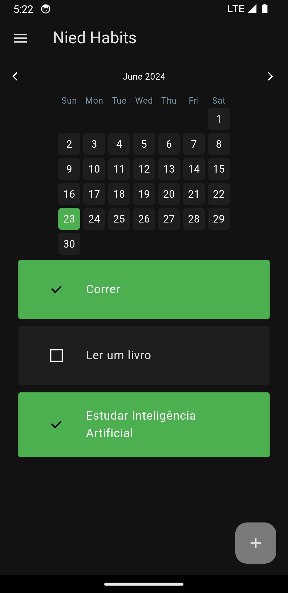

# Habit Tracker App

## Descrição

O Habit Better App é uma aplicação Flutter para ajudar você a criar e gerenciar hábitos. Com ele, você pode criar novos hábitos, marcar a conclusão diária e acompanhar seu progresso. Em breve, o app contará com funcionalidades de autenticação para permitir o compartilhamento de hábitos com outras pessoas, proporcionando monitoramento mútuo e incentivo.

## Images

<p align="center">
     
</p>

## Funcionalidades

- **Criação de Hábitos**: Adicione novos hábitos facilmente.
- **Checklist Diário**: Marque os hábitos que você completou diariamente.
- **Acompanhamento de Progresso**: Veja o histórico de conclusão dos seus hábitos.
- **Autenticação (Em breve)**: Permite compartilhar e monitorar hábitos com amigos.

## Tecnologias Utilizadas

- **Flutter**: Framework para a construção da interface do usuário.
- **Isar Database**: Banco de dados rápido e eficiente para armazenar dados localmente.
- **Provider**: Gerenciamento de estado reativo para Flutter.

## Instalação

Siga as instruções abaixo para configurar e executar o projeto localmente.

### Pré-requisitos

- Flutter SDK: [Instalação do Flutter](https://flutter.dev/docs/get-started/install)
- Dart SDK: Geralmente incluído na instalação do Flutter.
- IDE: Android Studio, VS Code ou outra IDE com suporte para Flutter.
- Isar CLI: Para gerenciar o esquema do banco de dados.

### Passos para Instalação

1. **Clone o repositório**

   ```bash
   git clone https://github.com/seu-usuario/habit-tracker-app.git
   cd habit-tracker-app
   ```

2. **Instale as dependências**

   ```bash
   flutter pub get
   ```

3. **Configure o Isar**

   Certifique-se de ter o Isar CLI instalado. Se ainda não instalou, siga as instruções [aqui](https://isar.dev/cli).

   ```bash
   isar init
   ```

4. **Execute o aplicativo**

   ```bash
   flutter run
   ```

## Estrutura do Projeto

```
habit-tracker-app/
├── lib/
│   ├── components/
│   │   ├── my_drawer.dart
│   │   └── my_habit_tile.dart
│   ├── database/
│   │   └── habit_database.dart
│   ├── models/
│   │   ├── app_settings.dart
│   │   └── habit.dart
│   ├── utils/
│   │   └── habit_util.dart
│   ├── views/
│   │   ├── home_page.dart
│   │   └── ...
│   └── main.dart
└── pubspec.yaml
```

## Funcionalidades Futuras

- **Autenticação de Usuário**: Permitirá que os usuários façam login e sincronizem seus dados na nuvem.
- **Compartilhamento de Hábitos**: Os usuários poderão compartilhar seus hábitos com amigos e monitorar o progresso uns dos outros.
- **Notificações**: Lembretes diários para ajudar os usuários a manterem seus hábitos.

## Contribuição

Contribuições são bem-vindas! Sinta-se à vontade para abrir issues e enviar pull requests.

1. Fork o repositório
2. Crie uma nova branch (`git checkout -b feature/nova-funcionalidade`)
3. Commit suas mudanças (`git commit -am 'Adicionei nova funcionalidade'`)
4. Push para a branch (`git push origin feature/nova-funcionalidade`)
5. Abra um Pull Request

## Licença

Este projeto está licenciado sob a licença MIT. Veja o arquivo [LICENSE](LICENSE) para mais detalhes.

## Contato

Para mais informações, entre em contato através do [seu-email@example.com](mailto:seu-email@example.com).

---

Obrigado por usar o Habit Tracker App! Juntos, podemos alcançar nossos objetivos e formar hábitos saudáveis. 🚀